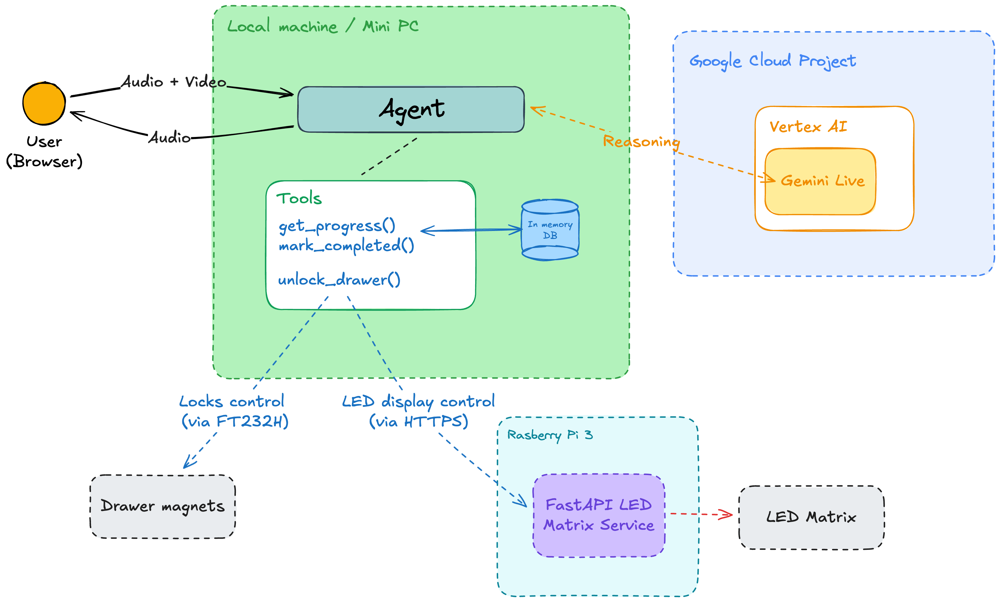

# Sweets Vault
A child shows their homework to the Sweets Vault. The Agent scans it, critiques the solution, 
and decides the effort is worth a prize. It unlocks the brake and dispenses sweets.

## Folder structure

Folder structure:

* [agent](agent/README.md) - main agent application
* docs - documentation and diagrams
* [hardware](hardware/README.md) - hardware interface and experiments
* [led-matrix-api](led-matrix-api/README.md) - API for controlling the LED matrix display
* README.md - this file

## Architecture

The diagram below presents the architecture of the Sweets Vault.

## Deployment

Start by deploying [led-matrix-api](led-matrix-api/README.md) on a Raspberry Pi. 
Then deploy [agent](agent/README.md) on a separate machine in the same network.

## Contributing

Contributions are welcome! Please feel free to submit a Pull Request.

## License

This project is licensed under the Apache License 2.0 - see the [LICENSE](LICENSE) file for details.